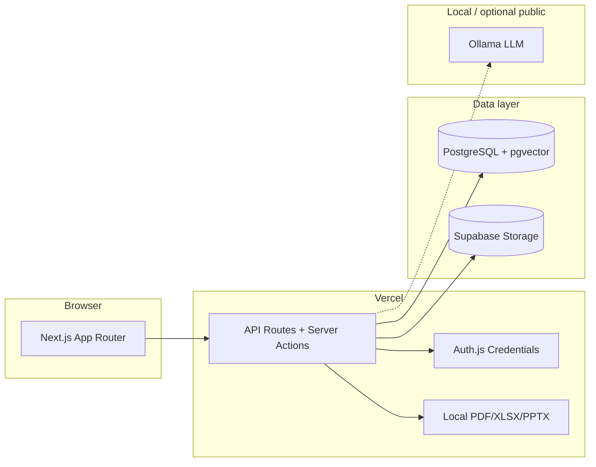

<p align="center">
  
</p>

<h1 align="center">NexusIQ-AI</h1>

<p align="center">
  <strong>Enterprise decision intelligence — multi-agent due diligence with citations, at zero API cost.</strong>
</p>

<p align="center">
  <a href="https://nexusiq-ai-steel.vercel.app">Live demo</a> ·
  <a href="./docs/00-product-prd.md">Product PRD</a> ·
  <a href="./docs/deployment.md">Deploy guide</a>
</p>

<p align="center">
  
  
  
  
</p>

---

## Overview

NexusIQ ingests a company **data room**, runs specialized AI agents in parallel (Financial, Legal, Compliance, Risk, Fraud), synthesizes an **explainable consensus**, surfaces **cross-document contradictions** and **missing evidence**, runs **what-if risk simulations**, tracks an **action-plan kanban**, exports **board-ready reports**, keeps a full **audit history** plus **settings / deferred deletion**, and offers **owner Admin** (health, usage, reindex) — every claim cited, every disagreement visible.

Built as a **solo, zero-API-cost** stack: Next.js on Vercel, PostgreSQL on Supabase, inference via local **Ollama**. No black-box recommendations.

> **Experience target:** Palantir depth · Bloomberg clarity · cited AI · Deloitte-grade diligence · Stripe polish.

---

## Live demo

| | |
|---|---|
| **URL** | [nexusiq-ai-steel.vercel.app](https://nexusiq-ai-steel.vercel.app) |
| **Try it** | Register → 3-step onboarding (org → workspace → project) → dashboard |
| **Deep dive** | Project → **Data Room** → **Intelligence** → **History / Settings / Admin** → **Reports** |

Cloud auth, orgs, workspaces, projects, data room, search, chat, intelligence, reports/export, timeline, graph, contradictions, missing-info, risks rollups, simulator, action plan, **History**, **Settings**, and **Admin** (owner) run on **Supabase + Vercel**. Chat / agent / contradiction scan / **simulations** need a reachable `OLLAMA_BASE_URL` (local or public HTTPS). Missing checklist, risks overview, Action Plan CRUD, History, Settings (except AI “Test connection”), Admin health/usage/FTS reindex, and report **assembly/export** work without Ollama when intelligence already exists.

---

## What's built today

### Shipped (slices 01–16 MVP)

| Area | Features |
|------|----------|
| **Auth** | Register, login, logout, forgot/reset password, profile (name, avatar), protected routes; deferred account deletion + `/account/recover` |
| **Organizations** | CRUD, slug generation, 3-step onboarding (org → workspace → optional project); org tombstone + 24h restore (“Recently deactivated”) |
| **Members & RBAC** | Owner, Admin, Analyst, Reviewer, Viewer — `requireOrgRole()` on every API; role guide (ⓘ) on Members |
| **Invites** | 7-day tokens, pending invite edit/cancel, accept via link or onboarding banner |
| **Notifications** | In-app bell + dropdown + `/dashboard/notifications` (archive / restore / bulk actions); CRITICAL contradiction alerts; task assigned; prefs in Settings |
| **Teams** | Create & list teams within an org |
| **Workspaces** | CRUD per org, unique slug, optional team, soft delete + Deleted tab, workspace cards with project counts |
| **Projects** | CRUD, five types, tags, deal status, default agent, pin/duplicate/bulk delete, workspace filter via URL |
| **Dashboard** | Stats row, risk donut, activity feed, recent reports, quick actions, onboarding nudge, empty states |
| **Project shell** | Overview, Data Room, Search, Intelligence, Chat, Reports, Timeline, Graph, Risks, Contradictions, Missing, Simulator, Actions, History — Smart Search–style tab headers |
| **Data room** | Folder tree, drag-drop upload/move, bulk upload, version history + compare, preview (PDF/image/text/Office/PPTX), tags & classification, filters, trash + retention, audit CSV, read-only share links, `?doc=&folder=&upload=` deep links |
| **Document processing** | Classify → OCR → chunk → embed → NER (local / worker path; Vercel inline optional via env) |
| **Search** | Hybrid keyword + semantic retrieval, filters, saved searches |
| **Chat** | Streaming cited Q&A, session history, confidence + citations |
| **Intelligence** | Specialist agents (Financial/Legal/Compliance/Risk/Fraud), Executive package, explainable Consensus, background full analysis |
| **Timeline + Graph** | AI/manual timeline events, relationship force graph, background extract |
| **Contradictions** | Cross-doc fact conflicts, citation-validated scan, side-by-side evidence, severity/status badges, resolution notes, promote-to-finding, bulk update |
| **Missing information** | Deal-type checklist vs data room, expected folder paths, follow-up export, background scan |
| **Risks overview** | Enterprise risk score, severity heatmap, open findings + contradiction/missing rollups |
| **Risk Simulator** | What-if scenarios (revenue / churn / lawsuit / price / custom) vs FINANCIAL+RISK baselines; score deltas, key impacts, run history; stores `SimulationRun` only |
| **Action Plan** | Status kanban, assignees, priorities, due dates, from-finding + suggest-from-intelligence (no Ollama), soft delete |
| **Reports & export** | Executive / Board / Investment Memo / Audit / Risk Register / Action Plan / PPTX; Markdown + PDF + XLSX + PPTX + ZIP; share links, compare, audience presets |
| **History** | Org + project audit feed (filters, date range), activity source labels (Intelligence / Data Room / Reports / …), project compare (side-by-side scores) |
| **Settings** | Shell tabs: Profile, Security (password + delete account), Notifications, AI Models (Ollama; env wins), Appearance (dark/light), Shortcuts |
| **Admin** | Owner-only `/dashboard/admin`: DB/Ollama/storage/queue health, usage charts, members, failed-doc retry, FTS / embeddings reindex (confirm); API never returns `OLLAMA_API_KEY` |
| **UI shell** | Dual-theme dashboard (dark default; light via Appearance), collapsible sidebar, command palette, keyboard shortcuts (`N`, `/`, `U`), responsive layout |

**Slice 17 (Polish)** — parallel UX backlog ([tasks/17-polish.md](./tasks/17-polish.md)); optional, non-blocking. Live OCI worker health remains deferred ([tasks/00-oci-worker-vps.md](./tasks/00-oci-worker-vps.md)).

---

## Demo data room

Synthetic M&A diligence files for bulk-upload demos (Helix Analytics fictional target), with intentional metric conflicts for contradiction demos:

```bash
pnpm demo:data-room    # regenerate demo/data-room/
```

1. Create an **M&A** project → open **Data Room** → **Upload**
2. Drag the entire `demo/data-room` folder — folder structure is preserved
3. Run **Intelligence** → **Contradictions** scan (or seed samples via `pnpm exec tsx scripts/seed-sample-contradictions.ts`) → **Missing** checklist → **Risks**
4. Open **Simulator** (needs FINANCIAL + RISK baselines + Ollama) and **Actions** (kanban / suggest from findings)
5. Open **Reports** → generate Risk Register or Board pack

See [demo/data-room/README.md](./demo/data-room/README.md) for the file inventory.

---

## Architecture



| Layer | Tech |
|-------|------|
| Frontend | Next.js 15, React 19, Tailwind, Radix, Framer Motion, Recharts |
| Auth | Auth.js v5, bcrypt, JWT sessions |
| Data | Prisma 6, PostgreSQL 16, pgvector |
| Storage | Local `./storage` (dev) or Supabase Storage (prod) |
| Export | `@react-pdf/renderer`, exceljs, pptxgenjs (local only — never calls Ollama) |
| Deploy | Vercel (app) + Supabase (DB, Storage) |
| AI | Ollama — `llama3`, `nomic-embed-text` (local or public HTTPS) |
| Tests | Vitest (390), Playwright (13 specs), Testing Library |

Modular monolith — one repo, feature slices under `features/`. See [docs/01-architecture.md](./docs/01-architecture.md).

---

## Quick start (local)

### Prerequisites

- **Node.js 20+** and **pnpm**
- **Docker** (for local Postgres)
- **Ollama** (for chat, agents, contradiction scan, narrative regenerate — optional for data room, missing checklist, risks overview, and tabular report export)

```bash
ollama pull llama3 && ollama pull nomic-embed-text
```

### Setup

```bash
git clone <repo-url> && cd nexusiq-ai
pnpm install
cp .env.example .env          # defaults work with Docker
docker compose up -d db
pnpm db:migrate
pnpm dev
```

Open **[http://localhost:3000](http://localhost:3000)** → register → onboarding → project → **Data Room** → **Intelligence** → **History / Settings / Admin** → **Reports**.

### Useful commands

| Command | Purpose |
|---------|---------|
| `pnpm dev` | Start dev server |
| `pnpm build` | Production build |
| `pnpm lint` | ESLint |
| `pnpm test` | Unit + integration tests (Vitest) |
| `pnpm test:e2e` | Playwright end-to-end (13 specs, uses local Docker DB) |
| `pnpm demo:data-room` | Generate synthetic diligence files in `demo/data-room/` |
| `pnpm db:studio` | Prisma Studio |
| `pnpm db:migrate` | Apply Prisma migrations (`prisma migrate deploy`) |
| `pnpm db:sync-to-supabase` | Copy local data → Supabase |
| `pnpm db:purge-deleted` | Hard-delete users/orgs past 24h grace (`purgeAfter`) |
| `pnpm db:purge-test-users` | Remove `*@test.com` fixtures |

---

## Deploy to production

Hackathon / judge setup uses **Vercel + Supabase**:

1. **Commit & push** your branch (migrations in `prisma/migrations/`)
2. **Run migrations** against Supabase (Session pooler, port 5432) — includes Slice 15 tombstones / `SystemSetting` and Slice 16 `MAINTENANCE` audit enum
3. Set env vars on Vercel (`DATABASE_URL` pooler :6543, `AUTH_SECRET`, `NEXT_PUBLIC_APP_URL`, Supabase Storage keys; optional `CRON_SECRET` for purge cron)
4. Verify `/api/health` returns `ok: true`; owners can open `/dashboard/admin`
5. **Optional:** `pnpm db:sync-to-supabase` after schema migrate; public `OLLAMA_BASE_URL` for chat/agents/contradiction scan/simulations / Admin re-embed on Vercel

Full walkthrough: **[docs/deployment.md](./docs/deployment.md)**

---

## Judge walkthrough (~5–10 min)

1. **Register** at `/register` → 3-step onboarding (org → workspace → project)
2. **Dashboard** — stats, risk overview, activity, quick actions
3. **Projects** — create M&A project → **Data Room** → upload `demo/data-room`
4. **Intelligence** — run specialists / full analysis (needs Ollama) → Consensus + Executive
5. **Contradictions / Missing / Risks** — cross-doc conflicts, checklist gaps, enterprise risk rollup
6. **Simulator / Actions** — what-if deltas (needs Ollama + FINANCIAL/RISK baselines); action-plan kanban (offline)
7. **History / Settings / Admin** — org audit + project compare; profile / AI / appearance (light or dark); owner Admin health + usage (offline except Ollama probe / re-embed)
8. **Reports** — generate Risk Register (works offline once findings exist) or Board pack; download PDF / ZIP
9. **Chat / Search** — cited Q&A and hybrid search (needs Ollama for semantic / chat)
10. **Pitch** — multi-agent diligence with citations, simulations, audit history, Admin ops, and local export at $0 API cost

Optional: **Share** data room or report → open token link in incognito.

---

## Project structure

```text
nexusiq-ai/
├── features/           # Vertical slices
│   ├── auth/
│   ├── organizations/
│   ├── workspaces/
│   ├── projects/
│   ├── data-room/
│   ├── search/
│   ├── chat/
│   ├── intelligence/
│   ├── reports/
│   ├── timeline/
│   ├── graph/
│   ├── contradictions/ # Slice 13
│   ├── missing/        # Slice 13
│   ├── risks/          # Slice 13
│   ├── simulator/      # Slice 14
│   ├── actions/        # Slice 14
│   ├── history/        # Slice 15
│   ├── settings/       # Slice 15
│   └── admin/          # Slice 16
├── src/app/            # Next.js routes + API
├── src/lib/ai/         # Agents, consensus, contradictions, missing-info, simulator
├── src/lib/export/     # PDF / Markdown / XLSX / PPTX generators
├── prisma/             # Schema + migrations
├── demo/data-room/     # Synthetic diligence files for upload demos
├── e2e/                # Playwright (auth → slice 16)
├── scripts/            # demo:data-room, seed-sample-contradictions, db sync, purge-deleted
├── docs/               # PRD, architecture, deployment, acceptance criteria
├── tasks/              # Slice specs 01–17
└── .cursor/rules/      # AI coding conventions
```

---

## Documentation

| Document | Description |
|----------|-------------|
| [docs/00-product-prd.md](./docs/00-product-prd.md) | Full enterprise PRD |
| [docs/01-architecture.md](./docs/01-architecture.md) | System design |
| [docs/02-data-model.md](./docs/02-data-model.md) | Prisma entities & enums |
| [docs/03-api-contracts.md](./docs/03-api-contracts.md) | API reference |
| [docs/05-ai-architecture.md](./docs/05-ai-architecture.md) | Agents, RAG, engines |
| [docs/08-acceptance-criteria.md](./docs/08-acceptance-criteria.md) | Per-slice definition of done |
| [docs/09-page-specifications.md](./docs/09-page-specifications.md) | Page-by-page specs |
| [docs/deployment.md](./docs/deployment.md) | Vercel + Supabase setup |
| [tasks/](./tasks/) | Feature slice tracker |
| [AGENTS.md](./AGENTS.md) | AI assistant operating instructions |

---

## Build roadmap

```text
 ✅ 01 Auth          ✅ 02 Organizations    ✅ 03 Workspaces
 ✅ 04 Projects      ✅ 05 Data Room        ✅ 06 Documents
 ✅ 07 Search         ✅ 08 Chat             ✅ 09 Agents
 ✅ 10 Consensus      ✅ 11 Reports          ✅ 12 Timeline + Graph
 ✅ 13 Contradictions ✅ 14 Simulator         ✅ 15 History + Settings
 ✅ 16 Admin         ○ 17 Polish (parallel backlog)
```

Core MVP (slices 01–16) is complete. Each slice ships with tests, loading/empty/error states, and WCAG 2.2 AA targets.

---

## Principles

- **Retrieve before reason** — agents cite source documents, never hallucinate freely
- **Explainable consensus** — per-agent opinions + resolution rationale, never a black box
- **Zero paid APIs** — Ollama local; cloud is app + database only
- **Production quality** — dual-theme premium UI (dark default), not lorem ipsum

---

## License

Private — all rights reserved.
