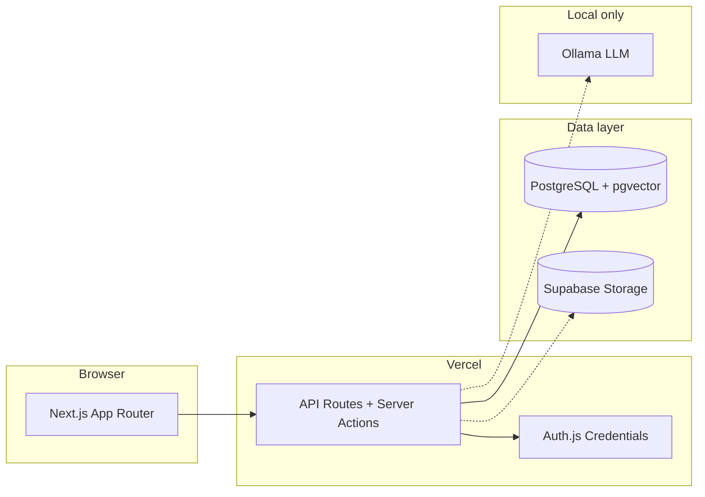

<p align="center">
  
</p>

<h1 align="center">NexusIQ-AI</h1>

<p align="center">
  <strong>Enterprise decision intelligence — multi-agent due diligence with citations, at zero API cost.</strong>
</p>

<p align="center">
  <a href="https://nexusiq-ai-steel.vercel.app">Live demo</a> ·
  <a href="./docs/00-product-prd.md">Product PRD</a> ·
  <a href="./docs/deployment.md">Deploy guide</a>
</p>

<p align="center">
  
  
  
  
</p>

---

## Overview

NexusIQ ingests a company **data room**, runs specialized AI agents in parallel (Financial, Legal, Compliance, Risk, Fraud), and produces an **explainable consensus report** — every claim cited, every disagreement visible.

Built as a **solo, zero-API-cost** stack: Next.js on Vercel, PostgreSQL on Supabase, inference via local **Ollama**. No black-box recommendations.

> **Experience target:** Palantir depth · Bloomberg clarity · cited AI · Deloitte-grade diligence · Stripe polish.

---

## Live demo

| | |
|---|---|
| **URL** | [nexusiq-ai-steel.vercel.app](https://nexusiq-ai-steel.vercel.app) |
| **Try it** | Register → 3-step onboarding (org → workspace → project) → dashboard |
| **Deep dive** | Projects, workspaces, org settings, members, invites, roles (ⓘ role guide) |

Cloud auth, orgs, workspaces, and projects run on **Supabase + Vercel**. Intelligence agents ship in upcoming slices (project shell + tab placeholders live today).

---

## What's built today

### Shipped (slices 01–04)

| Area | Features |
|------|----------|
| **Auth** | Register, login, logout, forgot/reset password, profile (name, avatar), protected routes |
| **Organizations** | CRUD, hard delete, slug generation, 3-step onboarding (org → workspace → optional project) |
| **Members & RBAC** | Owner, Admin, Analyst, Reviewer, Viewer — `requireOrgRole()` on every API; role guide (ⓘ) on Members |
| **Invites** | 7-day tokens, pending invite edit/cancel, accept via link or onboarding banner |
| **Notifications** | In-app bell + dropdown + `/dashboard/notifications` |
| **Teams** | Create & list teams within an org |
| **Workspaces** | CRUD per org, unique slug, optional team, soft delete + Deleted tab, workspace cards with project counts |
| **Projects** | CRUD, five types, tags, deal status, default agent, pin/duplicate/bulk delete, workspace filter via URL |
| **Dashboard** | Stats row, risk donut, activity feed, quick actions, onboarding nudge, empty states |
| **Project shell** | 13-tab navigation (Overview live; Data Room, Intelligence, Chat, Reports, etc. as placeholders) |
| **UI shell** | Premium dark dashboard, sidebar, command palette, keyboard shortcuts (`N`, `/`), responsive layout |

### Coming soon (slices 05–16)

| Slice | Focus |
|-------|--------|
| 05–06 | Data room + document processing |
| 07–08 | Search + cited chat |
| 09–11 | Intelligence agents + consensus + reports |
| 12–16 | Timeline, graph, simulator, action plan, history, admin |

---

## Architecture



| Layer | Tech |
|-------|------|
| Frontend | Next.js 15, React 19, Tailwind, Radix, Framer Motion, Recharts |
| Auth | Auth.js v5, bcrypt, JWT sessions |
| Data | Prisma 6, PostgreSQL 16, pgvector |
| Deploy | Vercel (app) + Supabase (DB, Storage) |
| AI (planned) | Ollama — `llama3`, `nomic-embed-text` |
| Tests | Vitest (103), Playwright (11), Testing Library |

Modular monolith — one repo, feature slices under `features/`. See [docs/01-architecture.md](./docs/01-architecture.md).

---

## Quick start (local)

### Prerequisites

- **Node.js 20+** and **pnpm**
- **Docker** (for local Postgres)

Ollama is only required once intelligence slices land.

### Setup

```bash
git clone <repo-url> && cd nexusiq-ai
pnpm install
cp .env.example .env          # defaults work with Docker
docker compose up -d db
pnpm db:migrate
pnpm dev
```

Open **[http://localhost:3000](http://localhost:3000)** → register → complete onboarding → explore **Dashboard** and **Projects**.

### Useful commands

| Command | Purpose |
|---------|---------|
| `pnpm dev` | Start dev server |
| `pnpm build` | Production build |
| `pnpm lint` | ESLint |
| `pnpm test` | Unit + integration tests (Vitest) |
| `pnpm test:e2e` | Playwright end-to-end (11 specs, uses local Docker DB) |
| `pnpm db:studio` | Prisma Studio |
| `pnpm db:sync-to-supabase` | Copy local data → Supabase |
| `pnpm db:purge-test-users` | Remove `*@test.com` fixtures |

---

## Deploy to production

Hackathon / judge setup uses **Vercel + Supabase**:

1. **Commit & push** your branch (migrations in `prisma/migrations/`)
2. **Run migrations** against Supabase (Session pooler, port 5432)
3. Set env vars on Vercel (`DATABASE_URL` pooler :6543, `AUTH_SECRET`, `NEXT_PUBLIC_APP_URL`)
4. Verify `/api/health` returns `ok: true`
5. **Optional:** `pnpm db:sync-to-supabase` after schema migrate

Full walkthrough: **[docs/deployment.md](./docs/deployment.md)**

---

## Judge walkthrough (~5 min)

1. **Register** at `/register` → 3-step onboarding (org → workspace → optional project)
2. **Dashboard** — stats, risk overview, activity, quick actions (New Project opens create modal)
3. **Projects** — create M&A project, open overview tab, browse shell tabs
4. **Workspaces** — create workspace; **View projects** auto-filters projects list
5. **Organizations** → Settings → invite second email (incognito to accept); **ⓘ** for roles
6. **Pitch** — multi-tenant UX + project scaffolding live; Ollama local by design (privacy + $0 API)

Optional: upload sample PDFs to Supabase Storage `documents` bucket for the data-room narrative.

---

## Project structure

```text
nexusiq-ai/
├── features/           # Vertical slices
│   ├── auth/
│   ├── organizations/
│   ├── workspaces/
│   └── projects/       # Slice 04: CRUD, dashboard, project shell
├── src/app/            # Next.js routes + API
├── prisma/             # Schema + migrations
├── e2e/                # Playwright specs (auth, orgs, workspaces, projects)
├── scripts/            # db:sync-to-supabase, purge-test-users
├── docs/               # PRD, architecture, deployment, acceptance criteria
├── tasks/              # Slice specs 01–16
└── .cursor/rules/      # AI coding conventions
```

---

## Documentation

| Document | Description |
|----------|-------------|
| [docs/00-product-prd.md](./docs/00-product-prd.md) | Full enterprise PRD |
| [docs/01-architecture.md](./docs/01-architecture.md) | System design |
| [docs/03-api-contracts.md](./docs/03-api-contracts.md) | API reference |
| [docs/08-acceptance-criteria.md](./docs/08-acceptance-criteria.md) | Per-slice definition of done |
| [docs/09-page-specifications.md](./docs/09-page-specifications.md) | Page-by-page specs |
| [docs/deployment.md](./docs/deployment.md) | Vercel + Supabase setup |
| [tasks/](./tasks/) | Feature slice tracker |
| [AGENTS.md](./AGENTS.md) | AI assistant operating instructions |

---

## Build roadmap

```text
 ✅ 01 Auth          ✅ 02 Organizations    ✅ 03 Workspaces
 ✅ 04 Projects      ○ 05 Data Room         ○ 06 Documents
 ○ 07 Search         ○ 08 Chat              ○ 09 Agents
 ○ 10 Consensus      ○ 11 Reports           ○ 12 Timeline
 ○ 13 Contradictions ○ 14 Simulator         ○ 15 History
 ○ 16 Admin
```

Sequential vertical slices — each ships with tests, loading/empty/error states, and WCAG 2.2 AA targets.

---

## Principles

- **Retrieve before reason** — agents cite source documents, never hallucinate freely
- **Explainable consensus** — per-agent opinions + resolution rationale, never a black box
- **Zero paid APIs** — Ollama local; cloud is app + database only
- **Production quality** — even placeholders are polished dark UI, not lorem ipsum

---

## License

Private — all rights reserved.
