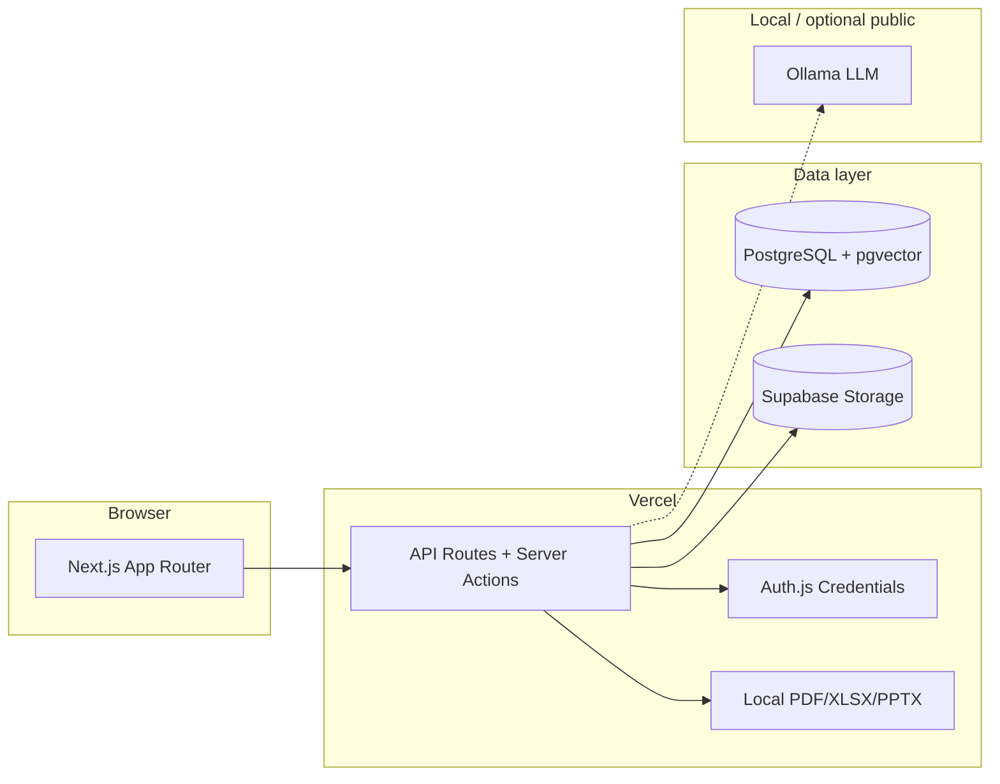

<p align="center">
  
</p>

<h1 align="center">NexusIQ-AI</h1>

<p align="center">
  <strong>Enterprise decision intelligence — multi-agent due diligence with citations, at zero API cost.</strong>
</p>

<p align="center">
  <a href="https://nexusiq-ai-steel.vercel.app">Live demo</a> ·
  <a href="./docs/00-product-prd.md">Product PRD</a> ·
  <a href="./docs/deployment.md">Deploy guide</a>
</p>

<p align="center">
  
  
  
  
</p>

---

## Overview

NexusIQ ingests a company **data room**, runs specialized AI agents in parallel (Financial, Legal, Compliance, Risk, Fraud), synthesizes an **explainable consensus**, and exports **board-ready reports** — every claim cited, every disagreement visible.

Built as a **solo, zero-API-cost** stack: Next.js on Vercel, PostgreSQL on Supabase, inference via local **Ollama**. No black-box recommendations.

> **Experience target:** Palantir depth · Bloomberg clarity · cited AI · Deloitte-grade diligence · Stripe polish.

---

## Live demo

| | |
|---|---|
| **URL** | [nexusiq-ai-steel.vercel.app](https://nexusiq-ai-steel.vercel.app) |
| **Try it** | Register → 3-step onboarding (org → workspace → project) → dashboard |
| **Deep dive** | Project → **Data Room** → **Intelligence** → **Reports** |

Cloud auth, orgs, workspaces, projects, data room, search, chat, intelligence, and **reports/export** run on **Supabase + Vercel**. Chat / agent narrative regenerate need a reachable `OLLAMA_BASE_URL` (local or public HTTPS). Report **assembly and PDF/MD/XLSX/PPTX export** work without Ollama when intelligence already exists.

---

## What's built today

### Shipped (slices 01–11)

| Area | Features |
|------|----------|
| **Auth** | Register, login, logout, forgot/reset password, profile (name, avatar), protected routes |
| **Organizations** | CRUD, hard delete, slug generation, 3-step onboarding (org → workspace → optional project) |
| **Members & RBAC** | Owner, Admin, Analyst, Reviewer, Viewer — `requireOrgRole()` on every API; role guide (ⓘ) on Members |
| **Invites** | 7-day tokens, pending invite edit/cancel, accept via link or onboarding banner |
| **Notifications** | In-app bell + dropdown + `/dashboard/notifications` (archive / restore / bulk actions) |
| **Teams** | Create & list teams within an org |
| **Workspaces** | CRUD per org, unique slug, optional team, soft delete + Deleted tab, workspace cards with project counts |
| **Projects** | CRUD, five types, tags, deal status, default agent, pin/duplicate/bulk delete, workspace filter via URL |
| **Dashboard** | Stats row, risk donut, activity feed, recent reports, quick actions, onboarding nudge, empty states |
| **Project shell** | Tab navigation — Overview, Data Room, Intelligence, Chat, Search, Reports live; Timeline/Graph/etc. placeholders |
| **Data room** | Folder tree, drag-drop upload/move, bulk upload, version history + compare, preview (PDF/image/text/Office/PPTX), tags & classification, filters, trash + retention, audit CSV, read-only share links, processing status bar |
| **Document processing** | Classify → OCR → chunk → embed → NER (local / worker path; Vercel inline optional via env) |
| **Search** | Hybrid keyword + semantic retrieval, filters, saved searches |
| **Chat** | Streaming cited Q&A, session history, confidence + citations |
| **Intelligence** | Specialist agents (Financial/Legal/Compliance/Risk/Fraud), Executive package, explainable Consensus, background full analysis |
| **Reports & export** | Executive / Board / Investment Memo / Audit / Risk Register / Action Plan / PPTX; Markdown + PDF + XLSX + PPTX + ZIP; share links, compare, audience presets, snapshot as-of, finding status, audit events |
| **UI shell** | Premium dark dashboard, collapsible sidebar, command palette, keyboard shortcuts (`N`, `/`, `U`), responsive layout |

### Coming soon (slices 12–16)

| Slice | Focus |
|-------|--------|
| 12 | Timeline + relationship graph |
| 13 | Contradictions + missing-info follow-ups |
| 14 | Risk simulator + action-plan kanban |
| 15 | History / settings / deferred deletion |
| 16 | Admin health, usage, reindex |

**Slice 17 (Polish)** — parallel UX backlog ([tasks/17-polish.md](./tasks/17-polish.md)); optional, non-blocking.

---

## Demo data room

Synthetic M&A diligence files for bulk-upload demos (Helix Analytics fictional target):

```bash
pnpm demo:data-room    # regenerate demo/data-room/ (17 files, ~84 KB)
```

1. Create an **M&A** project → open **Data Room** → **Upload**
2. Drag the entire `demo/data-room` folder — folder structure is preserved
3. Run **Intelligence** (specialists → consensus / executive) → open **Reports** → generate Risk Register or Board pack

See [demo/data-room/README.md](./demo/data-room/README.md) for the file inventory.

---

## Architecture



| Layer | Tech |
|-------|------|
| Frontend | Next.js 15, React 19, Tailwind, Radix, Framer Motion, Recharts |
| Auth | Auth.js v5, bcrypt, JWT sessions |
| Data | Prisma 6, PostgreSQL 16, pgvector |
| Storage | Local `./storage` (dev) or Supabase Storage (prod) |
| Export | `@react-pdf/renderer`, exceljs, pptxgenjs (local only — never calls Ollama) |
| Deploy | Vercel (app) + Supabase (DB, Storage) |
| AI | Ollama — `llama3`, `nomic-embed-text` (local or public HTTPS) |
| Tests | Vitest (293), Playwright (9 specs), Testing Library |

Modular monolith — one repo, feature slices under `features/`. See [docs/01-architecture.md](./docs/01-architecture.md).

---

## Quick start (local)

### Prerequisites

- **Node.js 20+** and **pnpm**
- **Docker** (for local Postgres)
- **Ollama** (for chat, agents, narrative regenerate — optional for data room + tabular report export)

```bash
ollama pull llama3 && ollama pull nomic-embed-text
```

### Setup

```bash
git clone <repo-url> && cd nexusiq-ai
pnpm install
cp .env.example .env          # defaults work with Docker
docker compose up -d db
pnpm db:migrate
pnpm dev
```

Open **[http://localhost:3000](http://localhost:3000)** → register → onboarding → project → **Data Room** → **Intelligence** → **Reports**.

### Useful commands

| Command | Purpose |
|---------|---------|
| `pnpm dev` | Start dev server |
| `pnpm build` | Production build |
| `pnpm lint` | ESLint |
| `pnpm test` | Unit + integration tests (Vitest) |
| `pnpm test:e2e` | Playwright end-to-end (9 specs, uses local Docker DB) |
| `pnpm demo:data-room` | Generate synthetic diligence files in `demo/data-room/` |
| `pnpm db:studio` | Prisma Studio |
| `pnpm db:migrate` | Apply Prisma migrations (`prisma migrate deploy`) |
| `pnpm db:sync-to-supabase` | Copy local data → Supabase |
| `pnpm db:purge-test-users` | Remove `*@test.com` fixtures |

---

## Deploy to production

Hackathon / judge setup uses **Vercel + Supabase**:

1. **Commit & push** your branch (migrations in `prisma/migrations/`)
2. **Run migrations** against Supabase (Session pooler, port 5432) — includes `reports` + `report_shares`
3. Set env vars on Vercel (`DATABASE_URL` pooler :6543, `AUTH_SECRET`, `NEXT_PUBLIC_APP_URL`, Supabase Storage keys)
4. Verify `/api/health` returns `ok: true`
5. **Optional:** `pnpm db:sync-to-supabase` after schema migrate; public `OLLAMA_BASE_URL` for chat/agents on Vercel

Full walkthrough: **[docs/deployment.md](./docs/deployment.md)**

---

## Judge walkthrough (~5–8 min)

1. **Register** at `/register` → 3-step onboarding (org → workspace → project)
2. **Dashboard** — stats, risk overview, activity, quick actions
3. **Projects** — create M&A project → **Data Room** → upload `demo/data-room`
4. **Intelligence** — run specialists / full analysis (needs Ollama) → Consensus + Executive
5. **Reports** — generate Risk Register (works offline once findings exist) or Board pack; download PDF / ZIP; optional share link
6. **Chat / Search** — cited Q&A and hybrid search (needs Ollama for semantic / chat)
7. **Pitch** — multi-agent diligence with citations + local export at $0 API cost; Timeline/Graph next

Optional: **Share** data room or report → open token link in incognito.

---

## Project structure

```text
nexusiq-ai/
├── features/           # Vertical slices
│   ├── auth/
│   ├── organizations/
│   ├── workspaces/
│   ├── projects/
│   ├── data-room/
│   ├── search/
│   ├── chat/
│   ├── intelligence/
│   └── reports/        # Slice 11: assemble, export, share, compare
├── src/app/            # Next.js routes + API
├── src/lib/export/     # PDF / Markdown / XLSX / PPTX generators
├── prisma/             # Schema + migrations
├── demo/data-room/     # Synthetic diligence files for upload demos
├── e2e/                # Playwright (auth → reports)
├── scripts/            # demo:data-room, db:sync-to-supabase, purge-test-users
├── docs/               # PRD, architecture, deployment, acceptance criteria
├── tasks/              # Slice specs 01–17
└── .cursor/rules/      # AI coding conventions
```

---

## Documentation

| Document | Description |
|----------|-------------|
| [docs/00-product-prd.md](./docs/00-product-prd.md) | Full enterprise PRD |
| [docs/01-architecture.md](./docs/01-architecture.md) | System design |
| [docs/03-api-contracts.md](./docs/03-api-contracts.md) | API reference |
| [docs/08-acceptance-criteria.md](./docs/08-acceptance-criteria.md) | Per-slice definition of done |
| [docs/09-page-specifications.md](./docs/09-page-specifications.md) | Page-by-page specs |
| [docs/deployment.md](./docs/deployment.md) | Vercel + Supabase setup |
| [tasks/](./tasks/) | Feature slice tracker |
| [AGENTS.md](./AGENTS.md) | AI assistant operating instructions |

---

## Build roadmap

```text
 ✅ 01 Auth          ✅ 02 Organizations    ✅ 03 Workspaces
 ✅ 04 Projects      ✅ 05 Data Room        ✅ 06 Documents
 ✅ 07 Search         ✅ 08 Chat             ✅ 09 Agents
 ✅ 10 Consensus      ✅ 11 Reports          ○ 12 Timeline
 ○ 13 Contradictions ○ 14 Simulator         ○ 15 History
 ○ 16 Admin          ○ 17 Polish (parallel backlog)
```

Sequential vertical slices — each ships with tests, loading/empty/error states, and WCAG 2.2 AA targets.

---

## Principles

- **Retrieve before reason** — agents cite source documents, never hallucinate freely
- **Explainable consensus** — per-agent opinions + resolution rationale, never a black box
- **Zero paid APIs** — Ollama local; cloud is app + database only
- **Production quality** — even placeholders are polished dark UI, not lorem ipsum

---

## License

Private — all rights reserved.
